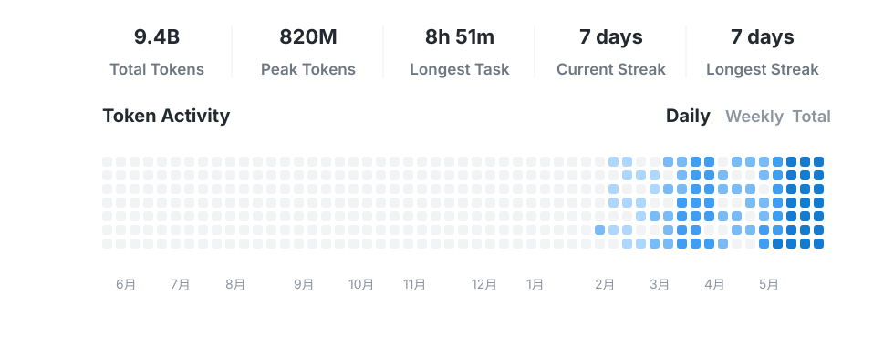

# Codex Token Activity

Generate a clean SVG card for your GitHub profile from the Codex Desktop profile API.

The card shows:

- Total tokens
- Peak daily tokens
- Longest task duration
- Current and longest streaks
- A contribution-style token activity heatmap



## Usage

Create a repository secret named `CODEX_BEARER_TOKEN` in the profile repository where you want to generate the SVG.

Then add a workflow like this:

```yaml
name: Update Codex token activity

on:
  schedule:
    - cron: "17 */12 * * *"
  workflow_dispatch:

permissions:
  contents: write

jobs:
  update:
    runs-on: ubuntu-latest
    steps:
      - uses: actions/checkout@v4
      - uses: jiayuqi7813/codex-token-activity@main
        with:
          codex-token: ${{ secrets.CODEX_BEARER_TOKEN }}
          output: assets/codex-token-activity.svg
      - uses: stefanzweifel/git-auto-commit-action@v5
        with:
          commit_message: "Update Codex token activity"
          file_pattern: assets/codex-token-activity.svg
```

Reference the generated SVG in your profile `README.md`:

```md
<p align="center">
  
</p>
```

## Local generation

```bash
export CODEX_BEARER_TOKEN="your bearer token"
python3 scripts/generate_codex_profile_svg.py --output assets/codex-token-activity.svg
```

For a demo card without a token:

```bash
python3 scripts/generate_codex_profile_svg.py --demo --output examples/codex-token-activity.svg
```

## Security

Do not commit your bearer token. Use GitHub Actions secrets or a local environment variable.

The generator only uses the token to call:

```text
https://chatgpt.com/backend-api/wham/profiles/me
```

The token is not written to the SVG or JSON output.

## License

MIT
